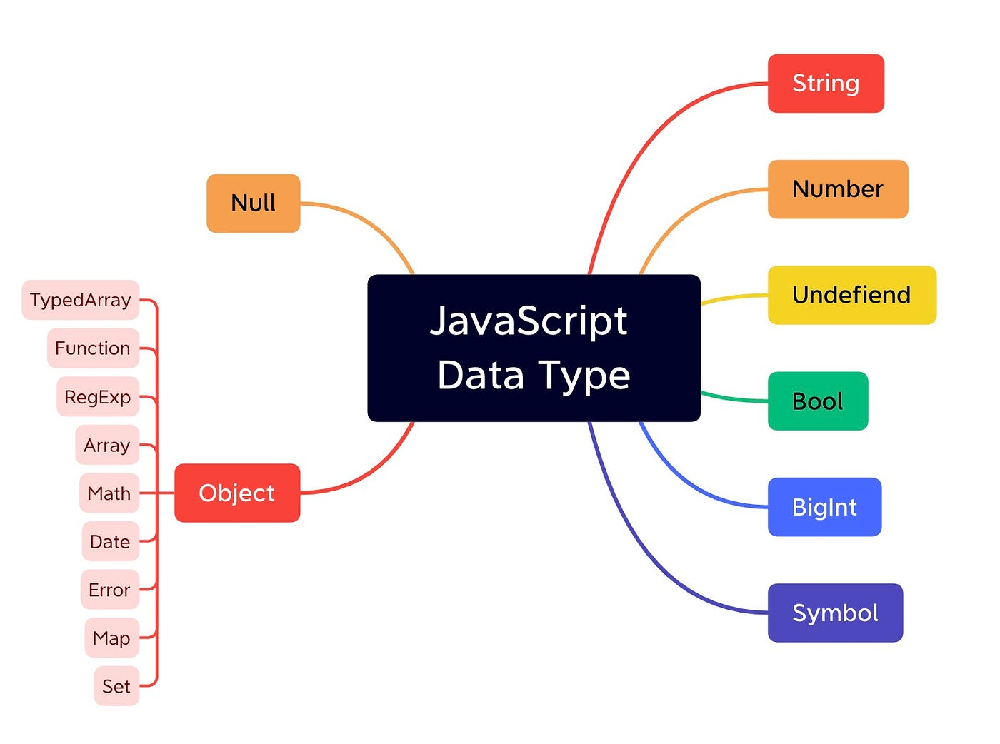

# JavaScript
Notes repo. for JavaScript tutorial.


# Content

In **JavaScript**, *scope* means **where in your code a variable or function can be accessed**.

---

### **1. Global Scope**

* Declared outside of any block/function → accessible anywhere.

```js
let name = "Abhigyan"; // global
console.log(name); // ✅ accessible here

function greet() {
    console.log(name); // ✅ accessible inside functions too
}
```

---

### **2. Function Scope**

* Variables declared inside a function (`var`, `let`, `const`) are only accessible in that function.

```js
function test() {
    let x = 10;
    console.log(x); // ✅ works
}
console.log(x); // ❌ Error: x is not defined
```

---

### **3. Block Scope**

* Variables declared with `let` or `const` inside `{}` are only accessible inside that block.

```js
if (true) {
    let y = 5;
    console.log(y); // ✅ works here
}
console.log(y); // ❌ Error: y is not defined
```

> `var` **ignores block scope** and leaks outside the block (old JS behavior).

---

### **4. Lexical Scope**

* Inner functions can access variables from their outer functions.

```js
function outer() {
    let a = "Outer Var";
    function inner() {
        console.log(a); // ✅ can access outer variable
    }
    inner();
}
outer();
```

---
# Data Types





JavaScript has **8 main data types** — split into **primitive** and **non-primitive**.

In JavaScript, **primitive** and **non-primitive** (reference) types are categorized based on **how the data is stored and accessed in memory**.

* **Primitive types** → Stored **directly** in the stack as a single value.
* **Non-primitive types** → Store a **reference (address)** to the object in the heap.

That’s why primitives are **copied by value**, while non-primitives are **copied by reference**.

   ### **Primitive Type** *(immutable, stored directly)*


1. **String** – text data

   ```js
   let name = "Abhigyan";
   ```
2. **Number** – integers & decimals (no separate int/float)

   ```js
   let age = 20;
   ```
3. **Boolean** – true or false

   ```js
   let isStudent = true;
   ```
4. **Undefined** – declared but not assigned

   ```js
   let city;
   ```
5. **Null** – intentional empty value, also a standalone value.

   ```js
   let price = null;
   ```
6. **Symbol** – unique identifier, used for uniqueness

   ```js
   let id = Symbol("id");
   ```
7. **BigInt** – large integers beyond Number limits

   ```js
   let bigNum = 123456789012345678901234567890n;
   ```

---

### **Non-Primitive Type** *(Reference Type)*

8. **Object** – collections of key–value pairs, arrays, functions, etc.

   ```js
   let user = { name: "Abhigyan", age: 20 };
   ```

In JavaScript, **reference data types** (non-primitives) store a **memory reference** to the actual data in the heap.

## **Main reference types:**

* **Object**
* **Array**
* **Function**
* **Date**
* **RegExp**
* **Map**, **Set**, **WeakMap**, **WeakSet**
* Any custom object you create

**Key points:**

* Copied **by reference**, not by value.
* Comparing two different references with `===` is **false**, even if they have the same content.

Example:

```javascript
let a = { name: "Abhigyan" };
let b = a;
b.name = "Alex";

console.log(a.name); // "Alex" (because a and b reference same object)
```

## Note -> **JavaScript is dynamically typed**.

That means you **don’t need to declare the data type** of a variable; the type is determined **at runtime** based on the value assigned, and it can change later.

Example:

```javascript
let x = 5;      // number
x = "Hello";    // now a string
```

---

## Memory

In JavaScript (and most programming languages), **stack** and **heap** are two different areas of memory with different purposes:

---

### **1. Stack** 🗂️

* Stores **primitive values** (`string`, `number`, `boolean`, `null`, `undefined`, `symbol`, `bigint`).
* Fixed size, fast access.
* Data is stored **by value** (copy is created).
* Variables in the stack are removed automatically when they go out of scope.

**Example (code):**

```javascript
let youtubename = "AbhigyanLabs"; // stored directly in stack
let anothername = youtubename;    // a copy is made
anothername = "Tech Incarnate";   // only this copy changes

console.log(youtubename); // "AbhigyanLabs"
console.log(anothername); // "Tech Incarnate"
```

---

### **2. Heap** 📦

* Stores **non-primitive values** (`object`, `array`, `function`, etc.).
* Dynamic size, slower access than stack.
* Data is stored **by reference** (stack holds a pointer to the object in heap).
* Changing one reference affects all variables pointing to that object.

**Example (code):**

```javascript
let userOne = {
    email: "abhigyan@google.com",
    age: 22
};

let userTwo = userOne; // both point to same heap object
userTwo.email = "vidyanshu@google.com"; // changes the shared object

console.log(userOne.email); // "vidyanshu@google.com"
console.log(userTwo.email); // "vidyanshu@google.com"
```

---


✅ **Quick Summary**

| Feature      | Stack      | Heap                |
| ------------ | ---------- | ------------------- |
| Stores       | Primitives | Objects & functions |
| Access speed | Fast       | Slower              |
| Storage type | Value      | Reference           |
| Size         | Fixed      | Dynamic             |


# Comparisons

**JS Comparison vs Equality**

* **Comparison (`<`, `>`, `<=`, `>=`)** → Converts to numbers

  * `null` → `0`
  * `undefined` → `NaN` (always false)

* **Loose equality (`==`)** → Type conversion

  * `null == undefined` → `true`
  * Else, `null` only equals itself

* **Strict equality (`===`)** → No conversion

  * Types must match exactly

=== in JavaScript is strict equality → compares value + type without type conversion.
---
In modern JavaScript, **template literals (`${}`)** are preferred over string concatenation with `+`.

**Example:**

```javascript
// Using +
let name = "Abhigyan";
let greeting = "Hello, " + name + "!";
console.log(greeting); // Hello, Abhigyan!

// Using template literal
let greeting2 = `Hello, ${name}!`;
console.log(greeting2); // Hello, Abhigyan!
```

**Why `${}` is better:**

* Cleaner and more readable for multiple variables.
* Supports multi-line strings easily.
* Reduces errors from missing spaces or quotes.

In short: **always prefer `` `${}` `` over `+` concatenation** in modern JS.

---

### **🔢 Numbers**

* JavaScript has **only one numeric type**:
* `Number.MAX_VALUE` → largest positive number (\~1.79e308)
* `Number.MIN_VALUE` → smallest positive number (>0, \~5e-324)
* `Number.MAX_SAFE_INTEGER` → `9007199254740991`
* `Number.MIN_SAFE_INTEGER` → `-9007199254740991`
* `Number.isNaN(value)` → checks if value is NaN (better than `isNaN()` global).
* `Number.isFinite(value)` → checks if value is a finite number.
* `parseInt("42")` → converts string to integer.
* `parseFloat("42.5")` → converts string to floating number.
* `toFixed(n)` → formats number to `n` decimal places (returns string).

---

### **📐 Math object**

* `Math.PI` → 3.141592653589793
* `Math.abs(x)` → absolute value.
* `Math.round(x)` → rounds to nearest integer.
* `Math.ceil(x)` → rounds up.
* `Math.floor(x)` → rounds down.
* `Math.trunc(x)` → removes decimal without rounding.
* `Math.sqrt(x)` → square root.
* `Math.pow(a, b)` → a raised to power b (`a ** b` is shorter).
* `Math.random()` → random number 0 ≤ x < 1.
* **Random in range**:

  ```js
  Math.floor(Math.random() * (max - min + 1)) + min
  ```
* `Math.min(...values)` / `Math.max(...values)` → smallest/largest value.
* `Math.sign(x)` → returns `1`, `-1`, or `0` depending on sign of x.

---

💡 **Tip:** Avoid direct equality checks with floating-point numbers (`0.1 + 0.2 === 0.3` → false). Use a small tolerance:

```js
Math.abs(0.1 + 0.2 - 0.3) < Number.EPSILON
```
# 📌 Math & Number in JavaScript

## 🔢 Number Constants

* `Number.MAX_VALUE` → Largest positive number JS can represent.
* `Number.MIN_VALUE` → Smallest positive number (closest to 0).
* `Number.MAX_SAFE_INTEGER` → Largest integer that can be represented safely (`2^53 - 1`).
* `Number.MIN_SAFE_INTEGER` → Smallest safe integer (`-(2^53 - 1)`).
* `Number.EPSILON` → Smallest difference between two representable numbers.

---

## 🧮 Parsing & Conversion

* `parseInt("42")` → Converts string to integer (`42`).
* `parseFloat("42.5")` → Converts string to floating number (`42.5`).
* `Number(value)` → Converts any value to number.
* `value.toFixed(n)` → Formats number with `n` decimal places.

---

## 📐 Rounding

* `Math.round(x)` → Rounds to nearest integer.
* `Math.ceil(x)` → Rounds **up**.
* `Math.floor(x)` → Rounds **down**.
* `Math.trunc(x)` → Removes decimal part.

---

## 🎲 Random

* `Math.random()` → Returns a pseudo-random number `0 ≤ x < 1`.
* **Range Formula**:

  ```js
  Math.floor(Math.random() * (max - min + 1)) + min
  ```

  → Random integer between `min` and `max` (inclusive).

---

## 📊 Powers & Roots

* `Math.pow(a, b)` / `a ** b` → Exponentiation.
* `Math.sqrt(x)` → Square root.
* `Math.cbrt(x)` → Cube root.

---

## 📏 Comparison

* `Math.min(...values)` → Smallest value.
* `Math.max(...values)` → Largest value.
* `Math.sign(x)` → Returns `-1`, `0`, or `1` depending on sign.
* `Number.isFinite(x)` → Checks if value is finite.
* `Number.isNaN(x)` → Checks if value is NaN.

---

## 💡 Tip

* **Floating-point precision check:**

  ```js
  Math.abs(0.1 + 0.2 - 0.3) < Number.EPSILON
  // true
  ```
# Dates

## JavaScript Date Methods Quick Reference
   Date is an object
   For rest refer to code file. It has commented and explained content.

# JavaScript Arrays – Quick Notes

* **Shallow Copy:** Changes in **nested objects/arrays** of the copy **also affect the original**. Only top-level changes are independent.

* **Deep Copy:** Changes in the copy **do NOT affect the original**, even for nested objects/arrays.


## Slice & Splice

**slice()** → returns a **new array**, original **unchanged**.
**splice()** → **changes the original array** (remove/add elements).

**Example:**

```javascript
let arr = [1,2,3,4];
arr.slice(1,3); // [2,3], arr unchanged
arr.splice(1,2); // removes 2 & 3, arr = [1,4]
```

---


## 1. Array Basics

* Can store **mixed datatypes**.
* Two ways to create:

```javascript
const arr1 = [1, 2, 3];
const arr2 = new Array(4, 5, 6);
```

* Access elements: `arr[0]`, `arr[1]`…

---

## 2. Adding/Removing Elements

| Method      | Description                   |
| ----------- | ----------------------------- |
| `push()`    | Add element at **end**        |
| `pop()`     | Remove element from **end**   |
| `unshift()` | Add element at **start**      |
| `shift()`   | Remove element from **start** |

---

## 3. Slice & Splice

* **slice(start, end)** → returns **new array**, original unchanged.
* **splice(start, deleteCount, …items)** → **modifies original array**.

```javascript
let arr = [1,2,3,4];
arr.slice(1,3); // [2,3], original unchanged
arr.splice(1,2); // removes 2 & 3, arr = [1,4]
```

---

## 4. Combining Arrays

* **concat()** → combines arrays without changing originals.
* **Spread operator (`...`)** → combine multiple arrays easily.

```javascript
const combined = [...arr1, ...arr2];
```

---

## 5. Nested Arrays

* **flat(depth)** → flattens nested arrays to specified depth.

```javascript
let arr = [1,[2,3,[4]]];
arr.flat(2); // [1,2,3,4]
```

---

## 6. Array Utilities

| Method            | Description                              |
| ----------------- | ---------------------------------------- |
| `Array.isArray()` | Check if a value is an array             |
| `Array.from()`    | Convert iterable (string, etc.) to array |
| `Array.of()`      | Create array from arguments              |

```javascript
Array.from("Hello"); // ['H','e','l','l','o']
Array.of(1,2,3);    // [1,2,3]
```

---

✅ **Tips**

* Use **slice** for safe copies.
* Use **splice** for editing original array.
* Spread operator `...` is handy for combining arrays.
* Use `flat()` for nested arrays.

---

# JavaScript Objects & Arrays - Quick Reference

## 1. Singleton Objects

* **Object Literal (preferred)**: `{}`
* **Constructor**: `new Object()`
* Used to create a single object.

```javascript
const user = { id: "123", name: "Sam", isLoggedIn: false };
```

*Properties can be added/modified dynamically.*

---

## 2. Nested Objects & Optional Chaining

* Objects can have objects inside them.
* Optional chaining `?.` prevents errors if a property is missing.

```javascript
const user = { fullname: { first: "Abhigyan", last: "Singh" } };
console.log(user.fullname?.last); // "Singh"
```

---

## 3. Merging Objects

* **Object.assign()** modifies the first object.
* **Spread operator** `{...obj1, ...obj2}` creates a new object.

```javascript
const obj1 = { a: 1 }; 
const obj2 = { b: 2 };
const merged = {...obj1, ...obj2}; // { a: 1, b: 2 }
```

---

## 4. Array of Objects

* Arrays can store multiple objects.
* Access by index.

```javascript
const users = [{name:"A"}, {name:"B"}];
console.log(users[1].name); // "B"
```

---

## 5. Object Utilities

* `Object.keys(obj)` → array of property names
* `Object.values(obj)` → array of values
* `Object.entries(obj)` → array of \[key, value] pairs
* `obj.hasOwnProperty("key")` → check if property exists

```javascript
console.log(Object.keys(user)); // ["fullname"]
console.log(user.hasOwnProperty("id")); // false
```

---

## Notes

* Use **object literals** for simplicity.
* **Optional chaining** prevents runtime errors.
* **Spread operator** is preferred for merging objects.
* Arrays + objects allow flexible data storage and access.
* Object utilities convert objects into arrays for iteration and checks.

---

# 🚀 JavaScript Execution Concepts

## **JavaScript Execution Context**

* The environment in which JavaScript code is evaluated and executed.
* Determines how variables, functions, and objects are accessed.

---

## **Global Execution Context (GEC)**

* Default context where the code starts running.
* Created when the JS engine starts executing your file.
* Two things happen automatically:

  * A **global object** is created (`window` in browsers, `global` in Node.js).
  * A special variable `this` is created (refers to the global object in non-strict mode).

---

## **Execution Context Types**

1. **Global Execution Context** → Created once, when the file runs.
2. **Function Execution Context** → Created every time a function is called.
3. **Eval Execution Context** → Created when code runs inside `eval()` (rarely used).

---

## **JavaScript is...**

* **Single-threaded**: Executes one command at a time.
* **Synchronous (by default)**: Runs line by line.
* Uses the **call stack** to manage execution.

---

## **Function Execution Context (FEC)**

* Created when a function is invoked.
* Has its own memory for variables, arguments, and inner functions.
* After execution, it gets destroyed and removed from the call stack.

---

## **Eval Execution Context**

* Created when using `eval()` to run code as a string.
* Not recommended (unsafe + slow).

---

## **How JS Code Executes**

JavaScript code execution happens in **two phases**:

1. **Memory Creation Phase (Hoisting Phase)**

   * Variables are allocated memory (initialized with `undefined`).
   * Functions are stored in memory completely.
   * `this` keyword is assigned.

2. **Execution Phase**

   * Code is executed line by line.
   * Variable assignments and function calls happen here.

---

## **Example**

```js
var a = 10;
function test() {
  var b = 20;
  console.log(a + b);
}
test();
```

### Steps:

1. **Global Execution Context created**

   * `a` → memory allocated (`undefined`)
   * `test` → function stored
   * `this` → global object

2. **Execution Phase**

   * `a = 10` assigned
   * `test()` is called → new **Function Execution Context** created

     * Inside `test`: `b` → memory allocated (`undefined`) → then assigned `20`.
     * Executes `console.log(a + b)` → prints `30`.

---

## **Call Stack**

* A data structure that keeps track of execution contexts.
* Works on **LIFO (Last In, First Out)**.
* Flow:

  * Global Execution Context is pushed first.
  * Each function call pushes a new Function Execution Context.
  * When a function finishes, its context is popped out.

---

# Loop

````markdown
## 🔄 Loops in JavaScript (with `break` & `continue`)

### 1. `for` Loop
- Used when you know the number of iterations in advance.  
- Syntax:
  ```js
  for (let i = 0; i < 5; i++) {
      console.log(i);
  }
````

* **`break`** → Exits the loop immediately.
* **`continue`** → Skips the current iteration and moves to the next one.

  ```js
  for (let i = 1; i <= 5; i++) {
      if (i === 3) continue;  // Skips when i=3
      if (i === 5) break;     // Exits loop when i=5
      console.log(i);
  }
  ```

---

### 2. `while` Loop

* Used when the number of iterations is **not known** beforehand.
* Runs **while the condition is true**.

  ```js
  let i = 0;
  while (i < 5) {
      console.log(i);
      i++;
  }
  ```

---

### 3. `do...while` Loop

* Executes **at least once**, even if the condition is false.
* Syntax:

  ```js
  let i = 0;
  do {
      console.log(i);
      i++;
  } while (i < 5);
  ```

---

✅ **Key Points to Remember**

* `for` → Best when iterations are fixed.
* `while` → Best when iterations depend on a condition.
* `do...while` → Ensures loop body runs at least once.
* `break` → Stops loop execution.
* `continue` → Skips the current iteration.

```
### 📌 `map()` in JavaScript

* `map()` is an **array method** that creates a **new array** by applying a function to **each element** of the original array.
* It does **not change** the original array.
* Commonly used for **transforming data**.

**Syntax:**

```js
array.map(callback(element, index, array))
```

* **callback** → Function applied to each element.
* **element** → Current element being processed.
* **index** → Index of the current element.
* **array** → The original array.

**Example:**

```js
const numbers = [1, 2, 3, 4];
const squared = numbers.map(num => num * num);
console.log(squared); // [1, 4, 9, 16]
```

---

### 📌 `reduce()` in JavaScript

* `reduce()` is an **array method** that reduces all elements of an array into a **single value**.
* It executes a **callback function** on each element, carrying over an **accumulator**.

**Syntax:**

```js
array.reduce(callback(accumulator, currentValue, index, array), initialValue)
```

* **accumulator** → Stores the result after each iteration.
* **currentValue** → Current element being processed.
* **initialValue** → (Optional) Starting value of the accumulator.

**Example (Sum of numbers):**

```js
const numbers = [1, 2, 3, 4];
const sum = numbers.reduce((acc, curr) => acc + curr, 0);
console.log(sum); // 10
```

**Example (Shopping cart total):**

```js
const shoppingCart = [
  { itemName: "js course", price: 2999 },
  { itemName: "python course", price: 999 },
  { itemName: "mobile dev course", price: 5999 },
  { itemName: "data science course", price: 12999 },
];

const totalPrice = shoppingCart.reduce((acc, item) => acc + item.price, 0);
console.log(totalPrice); // 22996
```

---

👉 `map()` → Creates a **new transformed array**.
👉 `reduce()` → Reduces an array into a **single value** (sum, product, total, etc).

---


The **DOM (Document Object Model)** in JavaScript is the programming interface that represents a webpage as a **tree of objects**. It allows JavaScript to **access, modify, add, or delete** HTML elements and their content dynamically.

---

### 🔹 What DOM Is

* Browser converts your **HTML document → into a DOM tree**.
* Each HTML element becomes a **node/object** in the tree.
* JavaScript can use the DOM to manipulate elements in real time.

---

### 🔹 Example DOM Tree

For this HTML:

```html
<!DOCTYPE html>
<html>
  <body>
    <h1 id="title">Hello World</h1>
    <p>Welcome!</p>
  </body>
</html>
```

DOM looks like a tree:

```
Document
 └── html
      └── body
          ├── h1 (#title)
          └── p
```

---

### 🔹 Common DOM Methods in JavaScript

1. **Select Elements**

   ```js
   document.getElementById("title");      // select by id
   document.getElementsByClassName("cls"); // select by class
   document.getElementsByTagName("p");    // select by tag
   document.querySelector("#title");      // modern single selector
   document.querySelectorAll("p");        // select all matching
   ```

2. **Change Content**

   ```js
   document.getElementById("title").innerText = "Hi Abhigyan!";
   document.getElementById("title").innerHTML = "<i>Hi!</i>";
   ```

3. **Change Style**

   ```js
   document.getElementById("title").style.color = "blue";
   ```

4. **Create & Add Elements**

   ```js
   let newP = document.createElement("p");
   newP.innerText = "New Paragraph";
   document.body.appendChild(newP);
   ```

5. **Remove Elements**

   ```js
   document.getElementById("title").remove();
   ```

---

### 🔹 Why DOM is Important

* Makes websites **dynamic & interactive**.
* Allows updating content without reloading page.
* Forms the core of **frontend development** with JS, React, Angular, etc.

---

## 🔹 **NodeList in JavaScript**

* Returned by DOM methods like `querySelectorAll()`.
* Looks like an array, but **not a true array**.
* Can be looped with `forEach`, but doesn’t have all array methods like `map`, `filter` (unless converted).

```js
let nodes = document.querySelectorAll("p"); 
console.log(nodes); // NodeList of <p> elements
```

---

## 🔹 **Array**

* Standard JavaScript data structure.
* Has full methods: `map()`, `filter()`, `reduce()`, etc.
* To convert a NodeList → Array:

```js
let arr = Array.from(document.querySelectorAll("p"));
// or
let arr2 = [...document.querySelectorAll("p")];
```

---

## 🔹 **Selectors in DOM**

Selectors are used to **find elements in HTML**:

* **`getElementById("id")`** → single element by `id`.
* **`getElementsByClassName("class")`** → HTMLCollection of elements.
* **`getElementsByTagName("tag")`** → HTMLCollection of elements.
* **`querySelector("css-selector")`** → first element that matches CSS selector.
* **`querySelectorAll("css-selector")`** → NodeList of all matches.

✅ Example:

```js
document.getElementById("title");        // by id
document.getElementsByClassName("box"); // by class
document.getElementsByTagName("div");   // by tag
document.querySelector(".box");         // first .box
document.querySelectorAll(".box");      // all .box
```

---

⚡ **Key Difference:**

* `querySelectorAll` → gives **NodeList** (can loop with `forEach`).
* `getElementsByClassName / TagName` → gives **HTMLCollection** (live, updates automatically if DOM changes).
* Convert NodeList/HTMLCollection to **Array** for advanced methods.

---
